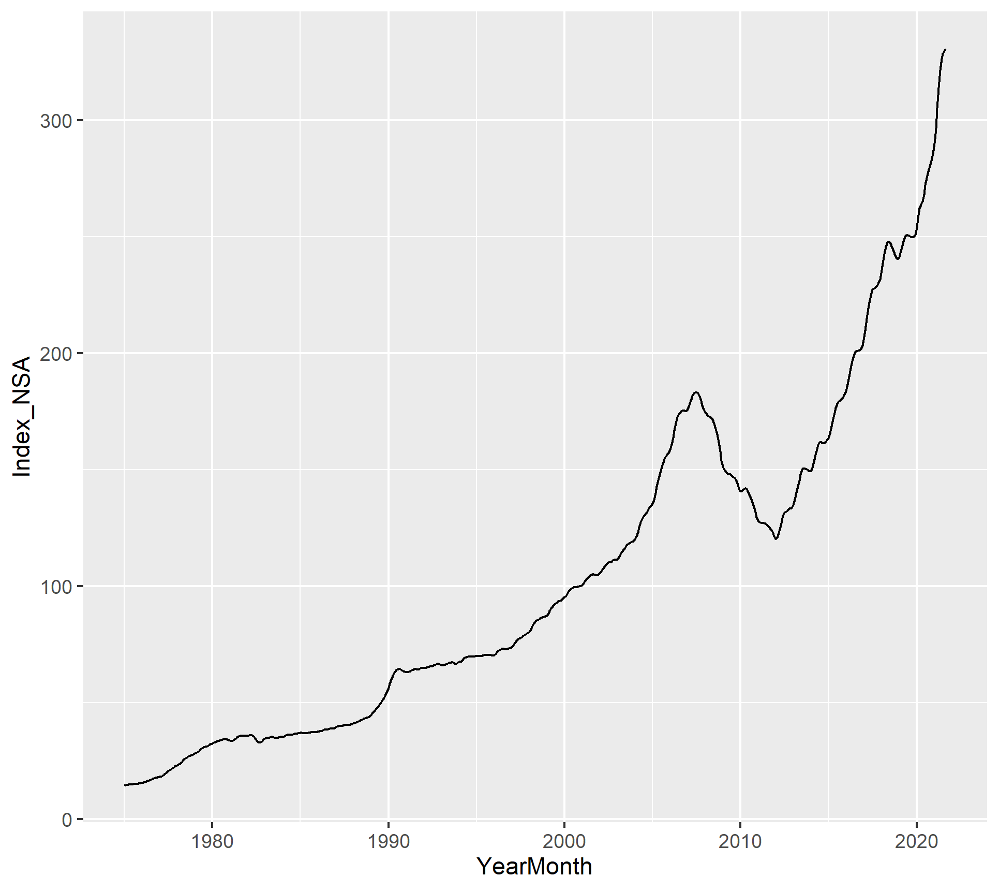

 
```{r echo = FALSE}

```

Introduction
=======================================

+Forecasting Housing Prices

- Housing price growth has exploded in recent months and house prices in general have increased from 1975 onward.
- Vital to lenders, individuals, and government officials to monitor changes in house prices over time to appropriately plan for home ownership and changes in housing affordability at scale.

+Research Question

- How did the pandemic impact the behavior of the housing price index and what is the appropriate scheme (fixed, recursive, or rolling) that will help us best forecast the housing price index values after the pandemic?


Data Description
=========================================

We used the Freddie Mac House Price Index (FMPHI) available at http://www.freddiemac.com/research/indices/house-price-index.page.

- The FMHPI provides a measure of typical price inflation for houses within the United States.
- Values are calculated monthly and released at the end of the following month.
- The data includes seasonally and non-seasonally adjusted series which are available at three different geographical levels (metropolitan, state, and national).
- The data set includes each month from January 1975 onward.

Housing Data Plot
=========================================

<br>

{width=500px height=500px}


Data Split
=========================================

+ Consistency in Average Points per Game across months


Scoring Trends By Day
=========================================

+ Consistency in Average Points per Game across days


Scoring Trends By Opponent
=========================================

+ Scores more against Portland and Utah (~35 pts per game) but not a large difference.
+ We want to see high-end production!


What are conditions when he does score more?
=========================================

+ Narrowed analysis down to 40+ point games
+ Removed 69 point game as that is once in a lifetime (12th highest total ever)
+ Michael Jordan scored 40+ points 132 times
  - Cleveland 12, Milwaukee 11, New York and Boston 10 

Over 40 Points - Months
=========================================

+ Average per game when over 40 points is close across months
  - March is highest


Over 40 Points - Days
=========================================

+ Average per game when over 40 points is different across days
  - Wednesday is highest by a large margin
  - Thursday close as well


Conclusion
=========================================

+ Based on the analysis related to games in which Michael Jordan scored at least 40 points I suggest:
  - March
  - Wednesday or Thursday
  - Against Cleveland, Milwaukee, New York or Boston
  
+ Washington Wizards play the Milwaukee Bucks on Friday, March 29

Appendix
=========================================

+ Since the 2001/02 season is over - what happened?
  - 5 games over 40
    - Season High 51 points - Saturday, December 29, 2001 vs Charlotte Hornets
    - 45 on Monday, December 31, 2001 vs New Jersey Nets
    - 44 on Friday, November 16, 2001 vs Utah Jazz
    - 41 on Saturday, January 26, 2002 vs Phoenix Suns
    - 40 on Thursday, January 24, 2002 vs Cleveland
  - On Friday March 29, 2002 - 34 points