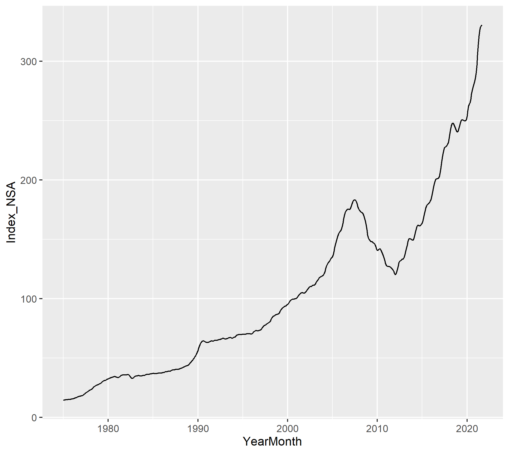

```{r setup, include=FALSE}
knitr::opts_chunk$set(echo = TRUE)
```

```{r libraries, include=FALSE}
# load libraries
library(tidyverse)
library(ggplot2)
library(jtools)
library(haven)
library(tidylog)
library(forecast)
library(tseries)
options(scipen=999)
```

+Forecasting Housing Prices

Housing price growth has exploded in recent months and house prices in general have increased from 1975 onward. It has become vital to lenders, individuals, and government officials to monitor changes in house prices over time to appropriately plan for home ownership and changes in housing affordability at scale. We want to investigate how house prices have changed in the last decade and compare pre-pandemic to post-pandemic price changes.

+Research Question

How did the pandemic impact the behavior of the housing price index and what is the appropriate scheme (fixed, recursive, or rolling) that will help us best forecast the housing price index values after the pandemic?

+Data Description

We used the Freddie Mac House Price Index (FMPHI) available at http://www.freddiemac.com/research/indices/house-price-index.page.

Per the Freddie Mac website "the FMHPI provides a measure of typical price inflation for houses within the United States. Values are calculated monthly and released at the end of the following month. For example, the FMHPI for March is published in late April." The data includes seasonally and non-seasonally adjusted series which are available at three different geographical levels (metropolitan, state, and national)for each month going all the way back to January 1975.

For our forecasting analysis we split the data into 3 sections based on the changes in the graph of NSA index over time. There is the 2011-presnet section and we then identified 2011-2019 as pre-pandemic and 2020-2021 as post-pandemic.

<br>

{width=500px height=500px}

# Read in data and wrangle

```{r}
# read in data
data <- read_csv("../02_raw_data/fmhpi_master_file.csv")

# look at the data
head(data, 10)
```


```{r}
# filter for target GEO
puget <- data %>% 
  filter(GEO_Type == 'CBSA', GEO_Name == 'Seattle-Tacoma-Bellevue WA')

puget$YearMonth <- as.Date(with(puget, paste(Year, Month, 1, sep="-")),"%Y-%m-%d")

puget_nsa <- puget[, c('YearMonth', 'Index_NSA')] %>% 
  filter(YearMonth >= '2011-01-01')

puget_sa <- puget[, c('YearMonth', 'Index_SA')] %>% 
  filter(YearMonth >= '2011-01-01')

# declare as TS
puget_nsa_ts <- ts(puget$Index_NSA, frequency=12, start=1975)  # monthly data

puget_sa_ts <- ts(puget$Index_SA, frequency=12, start=1975)  # monthly data
```

+ Data wrangling: 

    + filter geography for 'Seattle-Tacoma-Bellevue WA'
    + create new column for 'YearMonth' concatenating to be %Y-%m-%d format
    + filter dataset to be dates from 2011-present for research question 1

# Research Question 1: Forecasting from 2011-present

```{r}
# plot TS
plot(puget_nsa, col='blue', main='Seattle, Tacoma, Bellevue\nNon-Seasonally Adjusted index trends', ylab='Non-Seasonally Adjusted Index', xlab='Year')

plot(puget_sa, col='blue', main='Seattle, Tacoma, Bellevue\nNon-Seasonally Adjusted index trends', ylab='Seasonally Adjusted Index', xlab='Year')

# plot histogram
hist(puget_nsa_ts)
hist(puget_sa_ts)
```

**Comments**

+ Need to take difference to achieve stationarity

```{r}

# log difference of puget
ld_puget_nsa <- diff(log(puget_nsa_ts))
ld_puget_sa <- diff(log(puget_sa_ts))

# plot the logged difference datasets
plot(ld_puget_nsa, col='blue', main='Seattle, Tacoma, Bellevue\nLog Difference Index_NSA trends', ylab='Non-Seasonally Adjusted Index', xlab='Year')

plot(ld_puget_sa, col='blue', main='Seattle, Tacoma, Bellevue\nLog Difference Index_SA trends', ylab='Seasonally Adjusted Index', xlab='Year')

# create linear regression for time series data
# model1 <- dynlm(dp ~ lag(dp, -1) + lag(dr, -1))
```

**Comments**

+ After taking the log difference from the TS, does this yield a stationary trend?

    + This looks stationary but need to verify
    
+ What does this tell us?

```{r Plot ACF}
# auto correlation function
# 20 lags
acf(puget_nsa_ts, lag.max = 20, main='Puget NSA TS - ACF')
acf(puget_sa_ts, lag.max = 20, main='Puget SA TS - ACF')

# see values only and no plot
acf(puget_nsa_ts, lag.max = 20, plot = FALSE)
acf(puget_sa_ts, lag.max = 20, plot = FALSE)
```

**Comments**

+ How many lags should we be running?
+ Arbitrarily chose 20 lags
+ Plot never falls below statistically significant threshold in 20 lags

    + PACF will likely fall below threshold before ACF

```{r Plot PACF}
# PACF
pacf(puget_nsa_ts, lag.max = 20, main='Puget NSA TS - PACF')
pacf(puget_sa_ts, lag.max = 20, main='Puget SA TS - PACF')

# values only
pacf(puget_nsa_ts, lag.max = 20, plot = FALSE)
pacf(puget_sa_ts, lag.max = 20, plot = FALSE)
```

**Comments**

+ PACF falls below statistically significant threshold at lag 2

    + This indicates that we are working with an Auto Regressive (AR) process

**Questions**

+ How many lags should we be running?
    
    + Arbitrarily chose 20 lags
    
+ Does this indicate an ARIMA or ARMA model moving forward?
+ How do we determine what order of AR we are working with?

    + Perhaps once we determine a model?


```{r}
# log difference of ACF and PACF
# log difference ACF
acf(ld_puget_nsa, lag.max = 20, main = 'log diff Puget Sound Index_NSA - ACF')
acf(ld_puget_sa, lag.max = 20, main = 'log diff Puget Sound Index_SA - ACF')

```

**Comments**

+ Coefficients don't drop below significance level until lag 5 
+ Looks like a sinusoidal wave
+ Need to plot PACF logged difference 

```{r}
# log difference PACF
pacf(ld_puget_nsa, lag.max = 20, main = 'log diff Puget Sound Index_NSA - PACF')
pacf(ld_puget_sa, lag.max = 20, main = 'log diff Puget Sound Index_SA - PACF')
```

**Comments**

+ Oscillating coefficients indicate a negative number somewhere in the model or something like that
+ PACF drops below significance threshold at lag 5
    
    + Logged difference PACF indicates an AR process as well
    + Is this enough evidence to confirm AR process?
    + How can we verify via calculations?
    
**Questions** 

+ These tests are just visual tests. How do we determine AR vs. MA process computationally?

## Following ARIMA fitting guide using ggplot

### Examine Data
```{r}
# plot using ggplot just for fun
ggplot(puget, aes(YearMonth, Index_NSA)) + 
  geom_line() + scale_x_date('Year') + 
  labs(y = "Non-Seasonally Adjusted Index",
       title = "Seattle, Tacoma, Bellevue",
       subtitle = "Non-Seasonally Adjusted index trends") +
  theme_classic()
```

**Comments**

+ ggplot plot looks exactly the same as using Base R but with more flexibility to add components
+ ggplot needs a DF rather than a TS to create plot

```{r}

# try cleaning the data
puget_ts <- ts(puget[, c('Index_NSA')])
puget$clean_index_nsa <- tsclean(puget_ts)

ggplot() + 
  geom_line(data = puget, aes(x = YearMonth, y = clean_index_nsa)) + ylab('Cleaned Index NSA')
```

**Comments**

+ cleaning the data using tsclean() does not have an effect on our dataset
+ no outliers to clean

```{r}
# plot the cleaned series
# get MA(4) - quarterly MA
puget$nsa_ma04 = ma(puget$clean_index_nsa, order=4) # using the clean count with no outliers, get the MA

# get MA(12) - yearly MA
puget$nsa_ma12 = ma(puget$clean_index_nsa, order=12) # MA(12)

ggplot() + 
  geom_line(data = puget, aes(x = YearMonth, y = clean_index_nsa, colour = "Raw Data")) +
  geom_line(data = puget, aes(x = YearMonth, y = nsa_ma04,   colour = "Quarterly Moving Average"))  +
  geom_line(data = puget, aes(x = YearMonth, y = nsa_ma12, colour = "Yearly Moving Average"))  +
  labs(x = "Year", 
       y = "NSA Index",
       title = "Monthly MA vs. Weekly MA") + 
  theme_classic()
```

**Comments**

+ yearly MA appears to be a slightly smoother fit to our raw data plot
+ quarterly MA follows along almost spot on

### Decompose Data

+ Seasonality, Trend, Cycle to capture historical patterns in the series
+ Seasonality - fluctuations in the data related to calendar cycles
+ Trend - overall pattern of the series
+ Cycle - decreasing or increasing patterns that are not seasonal

```{r}
# Seasonality
nsa_ma <- ts(puget$Index_NSA, frequency=12)

decomp <- stl(nsa_ma, s.window="periodic")  # additive model structure
deseasonal_nsa <- seasadj(decomp)  # remove seasonality
plot(decomp)

```

**Comments**

+ Not sure what this is telling us
+ why is time not in my time window?
+ definitely trending upwards

### Stationarity

```{r}
# run ADF test
adf.test(nsa_ma, alternative = "stationary")
```

**Comments**

+ dickey-fuller test indicates a very high p-value
+ do these results indicate a stationary process?

### Autocorrelations and Choosing Model Order

```{r}
# plot ACF
Acf(nsa_ma, main='ACF')

# plot PACF
Pacf(nsa_ma, main='PACF')
```

```{r}
# calculate differences
count_d1 = diff(deseasonal_nsa, differences = 1)
plot(count_d1)
adf.test(count_d1, alternative = "stationary")
```


**Comments**

+ dickey-fuller test indicates a high p-value
+ do these results indicate a stationary process?


```{r}
# plot differenced ACF 
Acf(count_d1, main='ACF for Differenced Series')

# difference PACF
Pacf(count_d1, main='PACF for Differenced Series')
```

**Comments**

+ ACF:

    + spikes do not pass significance threshold until lag 11
    + distribution appears to be sinusoidal
    
+ PACF:

    + spike passes significance threshold at lag 4
    + distribution is somewhat oscilating

### Fitting an ARIMA model

```{r}
# Fit the ARIMA model
auto.arima(deseasonal_nsa, seasonal=FALSE)
```

**Comments**

+ p = 0
+ d = 2
+ q = 3
+ ARIMA Fitted Model
    
    + y_hat = 0.7689e_t-1 -0.2475e_t-2 - 0.4647e_t-3 + E
    

### Evaluate and Iterate

```{r}
# get a fit
fit <- auto.arima(deseasonal_nsa, seasonal=FALSE)

# plot the data
tsdisplay(residuals(fit), lag.max=45, main='(0,2,3) Model Residuals')
```

**Comments**

+ do we see any patterns here that would yield a better ARIMA model?
+ Should lag.max be 45?
+ do these residuals look like white noise?

    + residuals seem to be under control until around lag 9, then they grow larger
    
```{r}
# iterate our model using a different fit
fit2 = arima(deseasonal_nsa, order=c(1,1,1))
fit2
tsdisplay(residuals(fit2), lag.max=15, main='Seasonal Model Residuals')
```

**Comments**

+ how can we tell if fit2 is any better than our original?

```{r}
# try a forecast
fcast <- forecast(fit2, h=10)  # set horizon periods to 10. Does this indicate 10 years ahead?
plot(fcast, ylab = "Index_NSA")
```

**Comments**

+ does setting h=10 indicate a horizon of 10 periods, aka 10 years ahead?

```{r}
# forecast model future performance
hold <- window(ts(deseasonal_nsa))  # should start be used here?
fit_no_holdout = arima(ts(deseasonal_nsa))  # should order be specified here?
fcast_no_holdout <- forecast(fit_no_holdout, h=25)
plot(fcast_no_holdout, main="Forecast of performance for future model")
lines(ts(deseasonal_nsa))

```

**Comments**

+ not sure if this is correct at all

```{r}
# add seasonality back into our model
fit_w_seasonality = auto.arima(deseasonal_nsa, seasonal=TRUE)
fit_w_seasonality
```

**Comments**

+ This yields an ARIMA(0, 2, 3) process
+ AIC = 171.79
+ BIC = 182.84
+ Are AIC and BIC low enough to be effective?


# Research Question 2: Forecasting from 2011-2019 (pre-pandemic)


# Research Question 3: Forecasting from 2020-2021 (post-pandemic)

