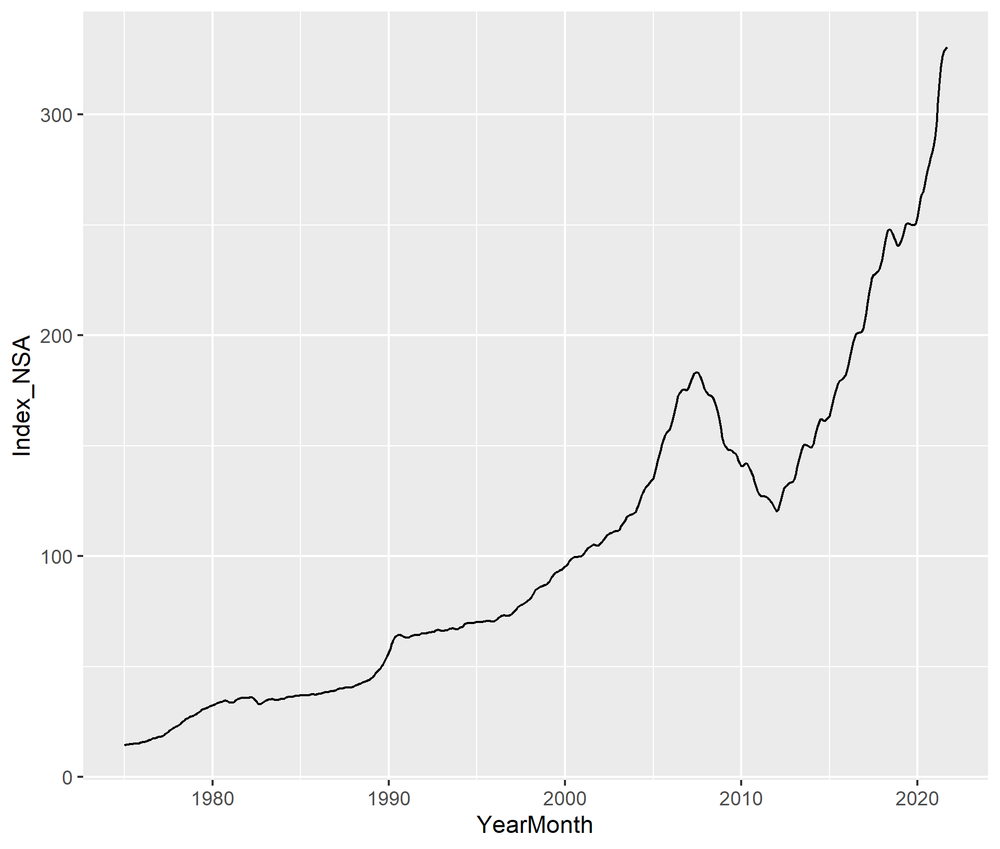
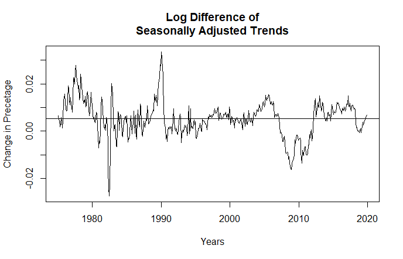
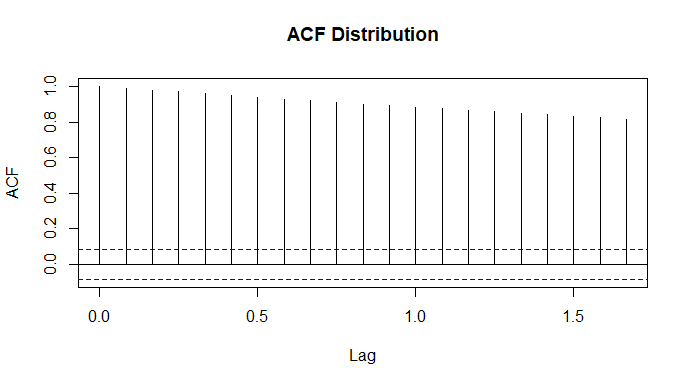
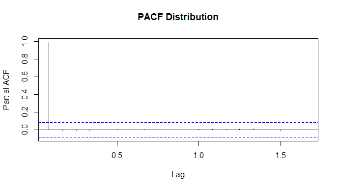
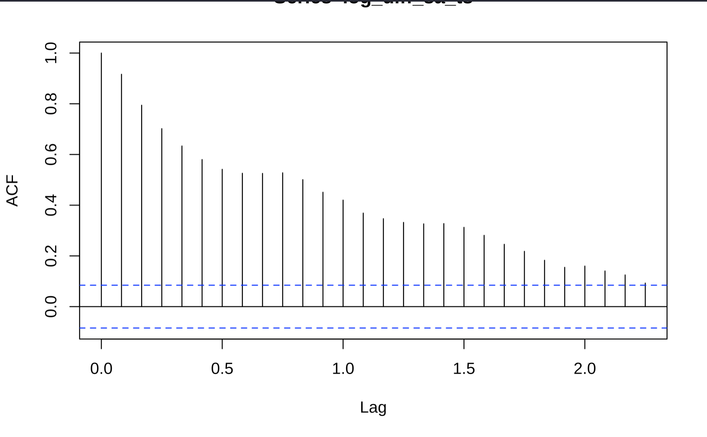
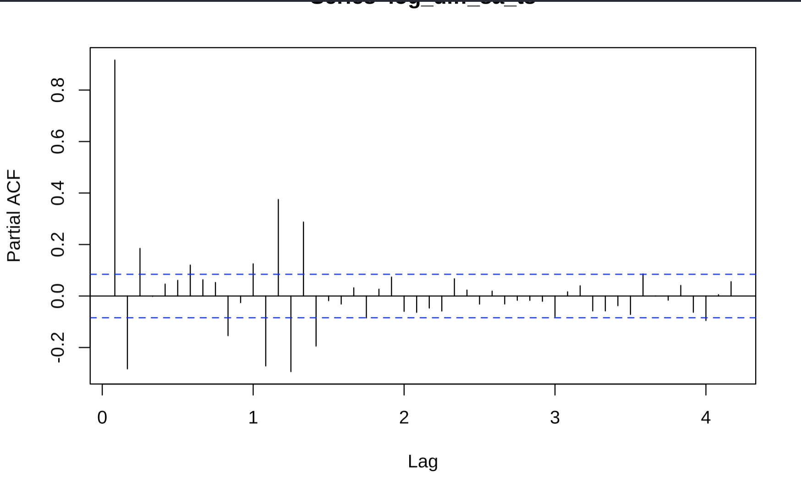
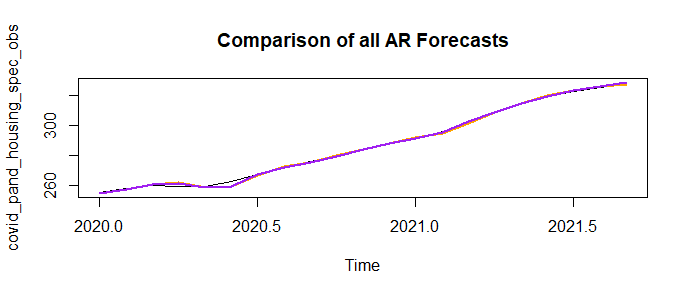

 
<<<<<<< HEAD
```{r echo = FALSE, message = FALSE, warning = FALSE}
library(tidyverse) # For transforming and tidying the data
library(dynlm) # For time series/dynamic regression models
library(forecast) # For ACF/PACF and ggACF/ggPACF
# library(vtable) is not used for the presentation
library (lubridate) # For creating and transforming data variables 
library(scales) # For transforming x and y axis plot scales
# library(patchwork) is not used for the presentation
library(stats) # For using lag function in the dynamic regressions 
library(tseries) # For creating, and visualizing time series data
library(kableExtra)

# loads csv into a base data frame
base_housing_data <- read_csv("fmhpi_master_file.csv")

# The following code will filter the base data_housing_data building a data frame for only the Seattle-Tacoma-Bellevue WA area from 1975 to 2019. This "pre-covid" time frame ends in Dec 2019. While the WHO did not declare COVID-19 a pandemic until March 2020, the effect of the disease on work, employment, etc. was already manifesting in February (Changes to the following code per the Professor's guidance 11/18/21). 

base_puget_precovid_data <- filter(base_housing_data, GEO_Name == 
                            'Seattle-Tacoma-Bellevue WA') %>% 
                            filter(Year <= 2019)

# Creates a new YearMonth date variable as a date class (day is set to 01).

base_puget_precovid_data$YearMonth <- as.Date(with(base_puget_precovid_data,paste(Year, Month, 1, sep="-")),"%Y-%m-%d") 
  
# Narrows the number of variables by removing the Code variables and then reorders the variables. The not seasonally adjust variable was removed per the Professor's guidance 11/18/21).

wip_puget_precovid_data <- base_puget_precovid_data %>% 
  select(YearMonth, Index_SA)

# Converts the data to in to a time series
index_sa_ts <- ts(wip_puget_precovid_data$Index_SA, frequency = 12, start = c(1975))
=======
```{r echo = FALSE}

>>>>>>> 38a3ffdce434cabbc6945083fdaf141dce9e5961
```

Introduction
=======================================

+ Forecasting Housing Prices

- Housing price growth has exploded in recent months and house prices in general have increased from 1975 onward.
- Vital to lenders, individuals, and government officials to monitor changes in house prices over time to appropriately plan for home ownership and changes in housing affordability at scale.

+ Research Question

- How did the pandemic impact the behavior of the housing price index and what is the appropriate scheme (fixed, recursive, or rolling) that will help us best forecast the housing price index values after the pandemic?

<<<<<<< HEAD
</div>
<div style="float: right; width: 50%;">
```{r echo = FALSE, message = FALSE, warning = FALSE, fig.height=5, fig.width=6}
# The following plots the not seasonally adjusted (nsa) index then assesses the acf and pacf.
plot(index_sa_ts, main = 'Freddie Mac Seasonally Adjusted Housing Price Index
     2011 - 2019 ', ylab = 'Housing Index', xlab = 'Year', col = 'blue')
```
</div>
=======
>>>>>>> 38a3ffdce434cabbc6945083fdaf141dce9e5961

Data Description
=========================================
- We used the Freddie Mac House Price Index (FMPHI) available at http://www.freddiemac.com/research/indices/house-price-index.page.

- The FMHPI provides a measure of typical price inflation for houses within the United States.
- Values are calculated monthly and released at the end of the following month.
- The data includes seasonally and non-seasonally adjusted series which are available at three different geographical levels (metropolitan, state, and national).
- The data set includes each month from January 1975 onward.


Housing Data Plot
=========================================
- We plotted the seasonally adjusted housing index trends of our data as a timeseries
  - Steady increase in the index from 1975 up to 2008 (which marks the beginning of the housing bubble burst)
  - Decreases until about 2012
  - Dramatic increases to the present.
<br>

<<<<<<< HEAD
- Initial Index Data not Stationary 
```{r echo = FALSE, message = FALSE, warning = FALSE, fig.height=5, fig.width=6}

# Plots none seasonally adjusted index time series
plot(index_sa_ts, main = 'Freddie Mac Seasonally Adjusted Housing Price Index
     2011 - 2019 ', ylab = 'Housing Index', xlab = 'Year', col = 'blue')
```

</div>
<div style="float: left; width: 50%;">
- Stationary log/diff Index 
```{r echo = FALSE, message = FALSE, warning = FALSE, fig.height=5, fig.width=6}

# Get the log difference of the time series in order to make it stationary
log_diff_sa_ts <- diff(log(index_sa_ts))

# Plots the log/diff time series
plot(log_diff_sa_ts, main = 'Log/Diff of Seasonally Adjusted Housing Index', ylab = 'Log Difference', xlab = 'Year', col = "blue")
abline(h = '.0053')
text(1978, .0065, "Unconditional", cex = .4, col = 'black')
text(1978, .0040, "Mean", cex = .4, col = 'black')
```

- The Augmented Dickey-Fuller Test
  + Critical Value @ 5%: -2.87 w/o Trend | -2.41 w/ Trend
  + ADF: -3.2757
    
</div>

Model Selection
==============================
<div style="float: left; width: 30%;">

- Elected to start with an AR(3) and AR(16) Model

```{r echo=FALSE, fig.height=2, fig.width=3, message=FALSE, warning=FALSE, }
# The following builds the acf and pacf plots for the stationary time series plots.

ggAcf(log_diff_sa_ts) +
  ylim(c(-.5, 1)) +
  theme_classic() + 
  ggtitle('ACF') +
  labs(y = ' ')

ggPacf(log_diff_sa_ts) +
  ylim(c(-.5, 1)) +
  theme_classic() + 
  ggtitle('PACF') +
  labs(y = ' ') 
  
```
</div>
<div style="float: left; width: 30%;">

- AR(3)
  + All value statically significant
  + Adjusted R^2^ = .86

```{r echo=FALSE, message=FALSE, warning=FALSE, fig.height=2, fig.width=3, results = 'hide'}
ar_3_model <-  dynlm(log_diff_sa_ts ~ 
                    stats::lag(log_diff_sa_ts, -1) +
                    # Used stats::lag because dplyr has a lag function 
                    # index_sa_ts is the original ts and not the log diff
                    stats::lag(log_diff_sa_ts, -2) + 
                    stats::lag(log_diff_sa_ts, -3), 
                    start = c(1975, 1), end = c(2019, 12))

summary(ar_3_model)
```

```{r echo=FALSE, message=FALSE, warning=FALSE, fig.height=2, fig.width=3}
ar_3_model_resid <- resid(ar_3_model)

ggAcf(ar_3_model_resid) +
  ylim(c(-.5, 1)) +
  theme_classic() + 
  ggtitle('ACF') +
  labs(main = 'AR(3) Residual ACF',y = ' ') 


ggPacf(ar_3_model_resid) +
  ylim(c(-.5, 1)) +
  theme_classic() + 
  ggtitle('PACF') +
  labs(main = 'AR(3) Residuals PACF', y = ' ')
```

</div>
<div style="float: left; width: 30%;">

- AR(16)
  + All value statically significant
  + Adjusted R^2^ = .90

```{r echo=FALSE, message=FALSE, warning=FALSE, fig.height=2, fig.width=3}
ar_16_model <- dynlm(log_diff_sa_ts ~
                            stats::lag(log_diff_sa_ts, -1) +
                        # Used stats::lag because dplyr has a lag function 
                        # index_sa_ts is the original ts and not the log diff
                            stats::lag(log_diff_sa_ts, -2) + 
                            stats::lag(log_diff_sa_ts, -3) +
                            stats::lag(log_diff_sa_ts, -11) +
                            stats::lag(log_diff_sa_ts, -12) + 
                            stats::lag(log_diff_sa_ts, -13) + 
                            stats::lag(log_diff_sa_ts, -14) + 
                            stats::lag(log_diff_sa_ts, -15) + 
                            stats::lag(log_diff_sa_ts, -16),
                            start = c(1975, 1), end = c(2019, 12))

ar_16_model_resid <- resid(ar_16_model)

ggAcf(ar_16_model_resid) +
  ylim(c(-.5, 1)) +
  theme_classic() + 
  ggtitle('ACF') +
  labs(main = 'AR(3) Residual ACF',y = ' ') 


ggPacf(ar_16_model_resid) +
  ylim(c(-.5, 1)) +
  theme_classic() + 
  ggtitle('PACF') +
  labs(main = 'AR(3) Residuals PACF', y = ' ')
```

</div>
=======
{width=300px height=300px}

Stationary Data
=========================================
- We applied the log difference 
  - Similar drop in index between 2008-2012, then see the trend return to the mean
  - Taking the log difference reveals a spike in 1990 and drops in the early 80’s and late 10’s
  - The plot appears to show a stationary profile
<br>

{width=500px height=375px}

ACF
=========================================
- The ACF indications that the process is not stationary.
<br>

{width=500px height=375px}

PACF & Dickey-Fuller
=========================================
- An Augmented Dickey-Fuller Test (adf test) was done to verify that our timeseries was indeed stationary
-The Dickey-Fuller critical value is well below the critical value and within the null rejection area.

<br>

{width=500px height=375px}
>>>>>>> 38a3ffdce434cabbc6945083fdaf141dce9e5961

Models
=========================================
<div style="float: left; width: 50%;">

- Schemes and Forecast
  + Assessed Fixed, Recursive, and Rolling
  + **Surprising** Fixed and Recursive gave same values
  + Recursive had smaller errors
  
```{r echo=FALSE, message=FALSE, warning=FALSE}
wip_puget_housing_obs <- filter(base_housing_data, GEO_Name == 
                            'Seattle-Tacoma-Bellevue WA') %>%  
                            select(Year, Month, Index_SA)

prediction_sample_ts <- ts(wip_puget_housing_obs$Index_SA, frequency = 12, start = c(1975, 1))

log_diff_prediction_ts <- diff(log(prediction_sample_ts))

covid_pand_housing_prediction_sample <- window(log_diff_prediction_ts, start = c(2020, 1))

#  This following 3 models will use the same 3 Forecast Modeling method but use a AR(16) to investigate over-fitting. 

fcast_pandemic_rolling <- numeric(21) 
# Produces a list of 21 zeros. That is the count of observations from 01/2020 - 05/2020

for (i in 1:21) {
  pand_model_rolling <- dynlm(log_diff_sa_ts ~
                            stats::lag(log_diff_sa_ts, -1) +
                        # Used stats::lag because dplyr has a lag function 
                        # index_sa_ts is the original ts and not the log diff
                            stats::lag(log_diff_sa_ts, -2) + 
                            stats::lag(log_diff_sa_ts, -3) +
                            stats::lag(log_diff_sa_ts, -11) +
                            stats::lag(log_diff_sa_ts, -12) + 
                            stats::lag(log_diff_sa_ts, -13) + 
                            stats::lag(log_diff_sa_ts, -14) + 
                            stats::lag(log_diff_sa_ts, -15) + 
                            stats::lag(log_diff_sa_ts, -16),
                            start = c(1975, 1 + i), end = c(2019, 11 + i))
                        # There are 539 log/diff observations from 01/1975 to 12/2019
  
  fcast_pandemic_rolling[i] <- coef(pand_model_rolling)[1] +
                            coef(pand_model_rolling)[2] *   
                            log_diff_prediction_ts[538 + i] +
                        # coef 1 & 2 = Intercept and B1 (lag 1)
                            coef(pand_model_rolling)[3] * log_diff_prediction_ts[537 + i] +
                        # coef 3 = B2 (lag 2)
                            coef(pand_model_rolling)[4] * log_diff_prediction_ts[536 + i] +
                        # coef 4 = B3 (lag 3)
                            coef(pand_model_rolling)[5] * log_diff_prediction_ts[528 + i] +
                        # coef 5 = B4 (lag 11)
                            coef(pand_model_rolling)[6] * log_diff_prediction_ts[527 + i] +
                        # coef 6 = B5 (lag 12)
                            coef(pand_model_rolling)[7] * log_diff_prediction_ts[526 + i] +
                        # coef 7 = B6 (lag 13)
                            coef(pand_model_rolling)[8] * log_diff_prediction_ts[525 + i] + 
                        # coef 8 = B7 (lag 14)
                            coef(pand_model_rolling)[9] * log_diff_prediction_ts[524 + i] +
                        # coef 9 = B8 (lag 15)
                            coef(pand_model_rolling)[10] * log_diff_prediction_ts[523 + i]
                        # coef 10 = B9 (lag 16)
}

fcast_pandemic_rolling_ts <- ts(fcast_pandemic_rolling, frequency = 12, start = c(2020, 1))

# This second model will use a Recursive Forecast Modeling method.

fcast_pandemic_recursive <- numeric(21) 
# Produces a list of 21 zeros. That is the count of observations from 01/2020 - 05/2020

for (i in 1:21) {
  pand_model_recursive <- dynlm(log_diff_sa_ts ~
                            stats::lag(log_diff_sa_ts, -1) +
                        # Used stats::lag because dplyr has a lag function 
                        # index_sa_ts is the original ts and not the log diff
                            stats::lag(log_diff_sa_ts, -2) + 
                            stats::lag(log_diff_sa_ts, -3) +
                            stats::lag(log_diff_sa_ts, -11) +
                            stats::lag(log_diff_sa_ts, -12) + 
                            stats::lag(log_diff_sa_ts, -13) + 
                            stats::lag(log_diff_sa_ts, -14) + 
                            stats::lag(log_diff_sa_ts, -15) + 
                            stats::lag(log_diff_sa_ts, -16), 
                            start = c(1975, 1), end = c(2019, 11 + i))
                        # There are 540 observations from 01/1975 to 12/2019
  
  fcast_pandemic_recursive[i] <- coef(pand_model_recursive)[1] +
                            coef(pand_model_recursive)[2] *   
                            log_diff_prediction_ts[539 + i] +
                        # coef 1 & 2 = Intercept and B1 (lag 1)
                            coef(pand_model_recursive)[3] * log_diff_prediction_ts[538 + i] +
                        # coef 3 = B2 (lag 2)
                            coef(pand_model_recursive)[4] * log_diff_prediction_ts[537 + i] +
                        # coef 4 = B3 (lag 3)
                            coef(pand_model_recursive)[5] * log_diff_prediction_ts[529 + i] +
                        # coef 5 = B4 (lag 11)
                            coef(pand_model_recursive)[6] * log_diff_prediction_ts[528 + i] +
                        # coef 6 = B5 (lag 12)
                            coef(pand_model_recursive)[7] * log_diff_prediction_ts[527 + i] +
                        # coef 7 = B6 (lag 13)
                            coef(pand_model_recursive)[8] * log_diff_prediction_ts[526 + i] + 
                        # coef 8 = B7 (lag 14)
                            coef(pand_model_recursive)[9] * log_diff_prediction_ts[525 + i] +
                        # coef 9 = B8 (lag 15)
                            coef(pand_model_recursive)[10] * log_diff_prediction_ts[524 + i]
                        # coef 10 = B9 (lag 16)
}

fcast_pandemic_recursive_ts <- ts(fcast_pandemic_recursive, frequency = 12, start = c(2020, 1))

fcast_pandemic_fixed <- numeric(21) 
# Produces a list of 21 zeros. That is the count of observations from 01/2020 - 05/2020

pand_model_fixed <- dynlm(log_diff_sa_ts ~
                            stats::lag(log_diff_sa_ts, -1) +
                        # Used stats::lag because dplyr has a lag function 
                        # index_sa_ts is the original ts and not the log diff
                            stats::lag(log_diff_sa_ts, -2) + 
                            stats::lag(log_diff_sa_ts, -3) +
                            stats::lag(log_diff_sa_ts, -11) +
                            stats::lag(log_diff_sa_ts, -12) + 
                            stats::lag(log_diff_sa_ts, -13) + 
                            stats::lag(log_diff_sa_ts, -14) + 
                            stats::lag(log_diff_sa_ts, -15) + 
                            stats::lag(log_diff_sa_ts, -16), 
                            start = c(1975, 1), end = c(2019, 12))
                        # The model will use only the observations from 01/1975 to 12/2019 
  

for (i in 1:21) {
  fcast_pandemic_fixed[i] <- coef(pand_model_fixed)[1] +
                            coef(pand_model_fixed)[2] *   
                            log_diff_prediction_ts[539 + i] +
                        # coef 1 & 2 = Intercept and B1 (lag 1)
                            coef(pand_model_fixed)[3] * log_diff_prediction_ts[538 + i] +
                        # coef 3 = B2 (lag 2)
                            coef(pand_model_fixed)[4] * log_diff_prediction_ts[537 + i] +
                        # coef 4 = B3 (lag 3)
                            coef(pand_model_fixed)[5] * log_diff_prediction_ts[529 + i] +
                        # coef 5 = B4 (lag 11)
                            coef(pand_model_fixed)[6] * log_diff_prediction_ts[528 + i] +
                        # coef 6 = B5 (lag 12)
                            coef(pand_model_fixed)[7] * log_diff_prediction_ts[527 + i] +
                        # coef 7 = B6 (lag 13)
                            coef(pand_model_fixed)[8] * log_diff_prediction_ts[526 + i] + 
                        # coef 8 = B7 (lag 14)
                            coef(pand_model_fixed)[9] * log_diff_prediction_ts[525 + i] +
                        # coef 9 = B8 (lag 15)
                            coef(pand_model_fixed)[10] * log_diff_prediction_ts[524 + i]
                        # coef 10 = B9 (lag 16)
}

fcast_pandemic_fixed_ts <- ts(fcast_pandemic_fixed, frequency = 12, start = c(2020, 1))

# The following creates the ts that will be used in the prediction sample. 
# Forecast horizon will be 21 (01/2020 - 05/2021). 
```

```{r echo=FALSE, message=FALSE, warning=FALSE, fig.height=5, fig.width=6}

plot(covid_pand_housing_prediction_sample, main = "Fix/Recursive and Rolling Forecast v. 2020/21 Actual Index", xlab = "Years", ylab = "Index", ylim = c(-.010, .025))
legend("bottomright", legend = c('2020/20201 Observed', 'Recursive', 'Rolling'), 
      lty=c(1,1,1), col = c('Black', 'Orange', 'Green'))
lines(fcast_pandemic_fixed_ts, col = 'green', lwd = 2)
lines(fcast_pandemic_recursive_ts, col = 'brown',lwd =1)
lines(fcast_pandemic_rolling_ts, col = 'orange', lwd = 2)

```

</div>
<div style="float: left; width: 40%;">

```{r echo=FALSE, message=FALSE, warning=FALSE}
kbl(accuracy(fcast_pandemic_rolling_ts, covid_pand_housing_prediction_sample)) %>%   kable_styling(bootstrap_options = c("striped", "hover", "condensed"))
kbl(accuracy(fcast_pandemic_recursive_ts, covid_pand_housing_prediction_sample)) %>% kable_styling(bootstrap_options = c("striped", "hover", "condensed"))
```

<<<<<<< HEAD
=======
- PACF has a significant drop off at lag 3 we decided to use an AR(3) model
- Also considered an AR(16) model but assumed that model would most likely be a case of over fitting
  - The spikes at lags 6 and 9 are not overly significant and were considered random variation
>>>>>>> 38a3ffdce434cabbc6945083fdaf141dce9e5961

{width=400px height=400px}
{width=400px height=400px}

Forecasts
=========================================

- Used fixed, recursive, and rolling schemes

<<<<<<< HEAD
=======
<br>
>>>>>>> 38a3ffdce434cabbc6945083fdaf141dce9e5961

{width=600px height=450px}


Loss Function and Assessing Forecasts
=========================================

- Symmetrical loss function
  - Errors in predicting the house price index both in over predicting and under predicting do have similar consequences as the main parties impacted are either buyers or sellers and the trade-off in an estimation error in either direction proportionately impact both parties the same
  - We determined that there is a not a clear loss in either scenario as a gain for one party is a loss for another and vice-versa.


Conclusions
=========================================

+ AR(3) model
  - We completed a recursive, fixed, and rolling scheme. The fixed and rolling schemes are consistent with each other and the recursive model provided a forecast width of 0.1 in the index. We also used the fixed and rolling schemes in the

+ AR(16) model
  - We completed a recursive, fixed, and rolling scheme and noted that those schemes also provide similar forecasts.
  - Behavior of lags 11-16 better mirror the 2020 -2021 behavior than the simpler lag 3 model (whose growth during the last 3 months of 2019 was significantly lower than previous lags).
  - Including these additional lags refined the model by including the type of index behavior one could expect during a “hot” market time frame that is not captured in the simpler, short term, lag 3 model