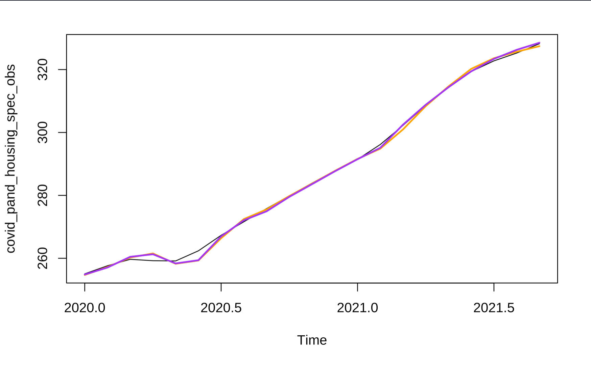

 
```{r echo = FALSE}

```

Introduction
=======================================

+ Forecasting Housing Prices

- Housing price growth has exploded in recent months and house prices in general have increased from 1975 onward.
- Vital to lenders, individuals, and government officials to monitor changes in house prices over time to appropriately plan for home ownership and changes in housing affordability at scale.

+ Research Question

- How did the pandemic impact the behavior of the housing price index and what is the appropriate scheme (fixed, recursive, or rolling) that will help us best forecast the housing price index values after the pandemic?


Data Description
=========================================

We used the Freddie Mac House Price Index (FMPHI) available at http://www.freddiemac.com/research/indices/house-price-index.page.

- The FMHPI provides a measure of typical price inflation for houses within the United States.
- Values are calculated monthly and released at the end of the following month.
- The data includes seasonally and non-seasonally adjusted series which are available at three different geographical levels (metropolitan, state, and national).
- The data set includes each month from January 1975 onward.

Housing Data Plot
=========================================

- We identified three separate sections in the data to test our scheme models ***Need to change this***

<br>

{width=500px height=500px}


Forecasting Models
=========================================

+ Model Selection
+ Schemes
+ Forecasts

{width=500px height=500px}
{width=500px height=500px}
{width=500px height=500px}

{width=500px height=500px}

Conclusions and next steps
=========================================

+ Determine the most appropriate models and schemes
+ MSE 


