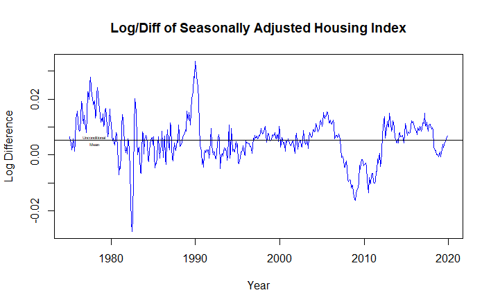

 
```{r echo = FALSE}

```

Introduction
=======================================

+ Forecasting Housing Prices

- Housing price growth has exploded in recent months and house prices in general have increased from 1975 onward.
- Vital to lenders, individuals, and government officials to monitor changes in house prices over time to appropriately plan for home ownership and changes in housing affordability at scale.

+ Research Question

- How did the pandemic impact the behavior of the housing price index and what is the appropriate scheme (fixed, recursive, or rolling) that will help us best forecast the housing price index values after the pandemic?


Data Description
=========================================
- We used the Freddie Mac House Price Index (FMPHI) available at http://www.freddiemac.com/research/indices/house-price-index.page.

- The FMHPI provides a measure of typical price inflation for houses within the United States.
- Values are calculated monthly and released at the end of the following month.
- The data includes seasonally and non-seasonally adjusted series which are available at three different geographical levels (metropolitan, state, and national).
- The data set includes each month from January 1975 onward.


Housing Data Plot
=========================================
- We plotted the seasonally adjusted housing index trends of our data as a timeseries
  - Steady increase in the index from 1975 up to 2008 (which marks the beginning of the housing bubble burst)
  - Decreases until about 2012
  - Dramatic increases to the present.
<br>

{width=300px height=300px}

Stationary Data
=========================================
- We applied the log difference 
  - Similar drop in index between 2008-2012, then see the trend return to the mean
  - Taking the log difference reveals a spike in 1990 and drops in the early 80’s and late 10’s
  - The plot appears to show a stationary profile
<br>

{width=500px height=375px}

ACF
=========================================
- The ACF indications that the process is not stationary.
<br>

{width=500px height=375px}

PACF & Dickey-Fuller
=========================================
- An Augmented Dickey-Fuller Test (adf test) was done to verify that our timeseries was indeed stationary
-The Dickey-Fuller critical value is well below the critical value and within the null rejection area.

<br>

{width=500px height=375px}

Models
=========================================

- PACF has a significant drop off at lag 3 we decided to use an AR(3) model
- Also considered an AR(16) model but assumed that model would most likely be a case of over fitting
  - The spikes at lags 6 and 9 are not overly significant and were considered random variation

{width=400px height=400px}
{width=400px height=400px}

Forecasts
=========================================

- Used fixed, recursive, and rolling schemes

<br>

{width=600px height=450px}


Loss Function and Assessing Forecasts
=========================================

- Symmetrical loss function
  - Errors in predicting the house price index both in over predicting and under predicting do have similar consequences as the main parties impacted are either buyers or sellers and the trade-off in an estimation error in either direction proportionately impact both parties the same
  - We determined that there is a not a clear loss in either scenario as a gain for one party is a loss for another and vice-versa.


Conclusions
=========================================

+ AR(3) model
  - We completed a recursive, fixed, and rolling scheme. The fixed and rolling schemes are consistent with each other and the recursive model provided a forecast width of 0.1 in the index. We also used the fixed and rolling schemes in the

+ AR(16) model
  - We completed a recursive, fixed, and rolling scheme and noted that those schemes also provide similar forecasts.
  - Behavior of lags 11-16 better mirror the 2020 -2021 behavior than the simpler lag 3 model (whose growth during the last 3 months of 2019 was significantly lower than previous lags).
  - Including these additional lags refined the model by including the type of index behavior one could expect during a “hot” market time frame that is not captured in the simpler, short term, lag 3 model