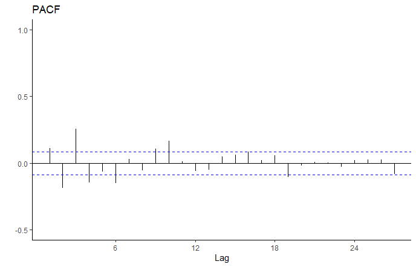
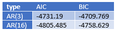
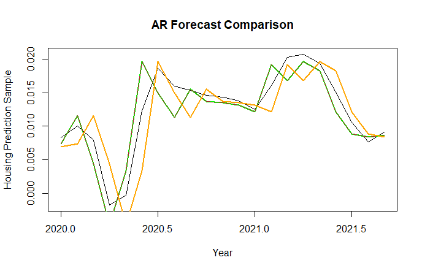
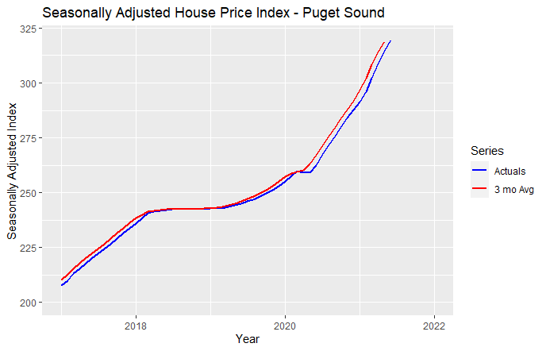

```{r setup, include=FALSE}
knitr::opts_chunk$set(echo = TRUE)
```

```{r include=FALSE}
# load libraries
library(tidyverse)
library(dynlm)
library(forecast)
library (lubridate)
library(scales)
library(patchwork)
library(stats)
library(tseries)
```

```{r include=FALSE}
# fetch data
# loads csv into a base data frame
base_housing_data <- read_csv("../02_raw_data/fmhpi_master_file.csv")

# the following code will filter the base data_housing_data building a data frame for only the Seattle-Tacoma-Bellevue WA area from 1975 to 2019. This "pre-covid" time frame ends in Dec 2019. While the WHO did not declare COVID-19 a pandemic until March 2020, the effect of the disease on work, employment, etc. was already manifesting in February (Changes to the following code per the Professor's guidance 11/18/21). 

base_puget_precovid_data <- filter(base_housing_data, GEO_Name == 
                            'Seattle-Tacoma-Bellevue WA') %>% 
                            filter(Year <= 2019)

# Creates a new YearMonth date variable as a date class (day is set to 01)

base_puget_precovid_data$YearMonth <- as.Date(with(base_puget_precovid_data,paste(Year, Month, 1, sep="-")),"%Y-%m-%d") 
  
# Narrows the number of variables by removing the Code variables and then reorders the variables. The not seasonally adjust variable was removed per the Professor's guidance 11/18/21)
wip_puget_precovid_data <- base_puget_precovid_data %>% 
  select(YearMonth, Index_SA)

# The following code will determine if the data is stationary 

#  The following converts the data to a time series using seasonally adjusted data 
index_sa_ts <- ts(wip_puget_precovid_data$Index_SA, frequency = 12, start = c(1975))

# The following code log diff's the sa index to make it stationary.
log_diff_sa_ts <- diff(log(index_sa_ts))
```

# Forecasting Housing Prices in Puget Sound

In the Puget Sound region, housing price growth has exploded in recent months and house prices in general have increased from 1975 onward. It has become vital to lenders, individuals, and government officials to monitor changes in house prices over time to appropriately plan for home ownership and changes in housing affordability at scale. Given these circumstances, our team decided to center the focus of our project on the following research question: 

How did the COVID-19 pandemic ("the pandemic") impact the behavior of the housing price index and what is the appropriate scheme (fixed, recursive, or rolling) that will help us best forecast the housing price index values into the future, after the pandemic?

# Data Description

We used the Freddie Mac House Price Index (FMPHI) available at http://www.freddiemac.com/research/indices/house-price-index.page.

Per the Freddie Mac website "the FMHPI provides a measure of typical price inflation for houses within the United States. Values are calculated monthly and released at the end of the following month. For example, the FMHPI for March is published in late April." The data includes seasonally and non-seasonally adjusted series which are available at three different geographical levels (metropolitan, state, and national) for each month, dating back to January 1975.

For this project, we utilized our entire monthly dataset, which ranged from January 1975 to September 2021. Figure 1 displays the seasonally adjusted housing index trends of our data as a timeseries. We see a steady increase in the trend line from 1975 up to 2008, which marks the beginning of the housing bubble burst. The trend decreases until about 2012, then the trend dramatically increases up to the present. 

<br>

{width=600px height=450px}

Figure 1: The plot does not display a traditional stationary process profile.  

To make our data stationary, we applied the log difference as seen in Figure 2. We witness a similar drop in index between 2008-2012, then see the trend return to the mean. Taking the log difference reveals a spike in 1990 that did not seem significant in Figure 1. We also see dips in the early 80's and late 10's that do not appear to be present in the raw data plot. The plot appears to show a stationary profile.

<br>

{width=600px height=450px}

Figure 2: The log diff time series values are normally distributed with a mean of 0.0053 and a standard deviation of 0.0077. 

Below are visuals of the Auto-Correlation Function distribution and the Partial-Auto-Correlation Function distribution for our entire dataset. 

<br>

{width=600px height=450px}

Figure 3: The ACF indications that the process is not stationary.

<br>

{width=600px height=450px}


Figure 4: PACF distribution of our entire dataset

An Augmented Dickey-Fuller Test (adf test) was done to verify that our timeseries was indeed stationary. The results of our adf test is found below: 

```{r echo=FALSE}
# The following code will conduct an Augmented Dickey-Fuller test to determine is the series is indeed stationary.

adf.test(log_diff_sa_ts)
```

Figure #: Augmented Dickey-Fuller test results

From these results, we concluded that the series is stationary. The Dickey-Fuller critical value is -2.87 (~500 observations, 5% without trend, with trend is -2.41). The order 1 diff time series' stat was -3.2757, well below the critical value and within the null rejection area. 

# Selecting a model

Now that we confirmed that we were working with a stationary series after applying the log difference, the ACF and PACF were both taken with the updated timeseries to determine the model that would best forecast our data. 

<br>

{width=600px height=450px}

Figure #: The ACF has a geometrically decaying correlation indicative of a AR model.

Because the ACF above has a geometrically decaying collation, it was concluded that the use of an Auto Regressive (AR) model would be most appropriate.

<br>

{width=600px height=450px}

Figure #: The PACF has a significant drop off at lag 3, then another group of significant spikes between lags 12 and 17. 

Because the PACF has a significant drop off at lag 3 we decided to use an AR(3) model. We also considered an AR(16) model but assumed that model would most likely be a case of over fitting. The spikes at lags 6 and 9 are not overly significant and were considered random variation.


# Assessing the models

The AR(3) model was explored first. The summary statistics of the AR(3) model can be found in the figure below:

```{r echo=FALSE}
ar_3_model <-  dynlm(log_diff_sa_ts ~ 
                    stats::lag(log_diff_sa_ts, -1) +
                    # Used stats::lag because dplyr has a lag function 
                    # index_sa_ts is the original ts and not the log diff
                    stats::lag(log_diff_sa_ts, -2) + 
                    stats::lag(log_diff_sa_ts, -3), 
                    start = c(1975, 1), end = c(2019, 12))

summary(ar_3_model)
```

Figure #: Summary statistics of the AR(3) model

The plots of the error residuals of the AR(3) model were analyzed and can be found in the figures below. 

<br>

{width=600px height=450px}

Figure #: ACF AR(3) residuals plot

<br>

{width=600px height=450px}

Figure #: PACF (AR3) residuals plot

Both the ACF and PACF have numerous spikes that are of significance especially lag 8 and onward. It was determined that this was not the best model so we decided to run the same analysis for the AR(16) model.

The AR(16) model was explored next. The summary statistics of the AR(16) model can be found in the figure below:

```{r echo=FALSE}
ar_16_model <- dynlm(log_diff_sa_ts ~
                            stats::lag(log_diff_sa_ts, -1) +
                        # Used stats::lag because dplyr has a lag function 
                        # index_sa_ts is the original ts and not the log diff
                            stats::lag(log_diff_sa_ts, -2) + 
                            stats::lag(log_diff_sa_ts, -3) +
                            stats::lag(log_diff_sa_ts, -11) +
                            stats::lag(log_diff_sa_ts, -12) + 
                            stats::lag(log_diff_sa_ts, -13) + 
                            stats::lag(log_diff_sa_ts, -14) + 
                            stats::lag(log_diff_sa_ts, -15) + 
                            stats::lag(log_diff_sa_ts, -16),
                            start = c(1975, 1), end = c(2019, 12))
summary(ar_16_model)
```

Figure #: Summary statistics of the AR(16) model

The plots of the error residuals of the AR(16) model were analyzed and can be found in the figures below. 

<br>

{width=600px height=450px}

Figure #: ACF AR(16) residuals plot

<br>

{width=600px height=450px}

Figure #: PACF AR(16) residuals plot

The AR(16) model returned less lags that surpassed the significance threshold in both the ACF and PACF. Having consistent lags that do not surpass the significance threshold is an indicator that our process has become white noise. The AIC and BIC coefficients were calculated for both models to validate via calculation which model would perform better. 

<br>

{width=250px height=75px}

The model with lower AIC and BIC should be chosen, so we chose to move forward with the AR(16) model for the remainder of our analysis. 

# Forecasting schemas

We then prepared AR(3) and AR(16) models using fixed, recursive, and rolling schemes to make the predictions. The figure below illustrates all three schemes included in the same plot. 

<br>

{width=600px height=450px}

Figure #: AR Forecast comparison between Fixed, Recursive, and Rolling schemes

The AR(3) and AR(16) forecasts are very similar during the first half of 2020. Like all the models, the forecasts for the first half of 2020 lag the actual market behavior by about 30-45 days. We also note that the forecasts become more accurate during the second half of 2020. Based on the plots, after mid-2020, the AR(16) model becomes the better predictor of market behavior.

# Choosing a Loss Function

We think that we have a symmetrical loss function. Errors in predicting the house price index both in over predicting and under predicting do have similar consequences as the main parties impacted are either buyers or sellers and the trade-off in an estimation error in either direction proportionately impact both parties the same. We determined that there is a not a clear loss in either scenario as a gain for one party is a loss for another and vice versa.

# Assessing the forecasts

The traditional convention is to choose a simpler model (ie AR(3) in this scenario) because a simpler model is more likely to reflect the behaviors of a population when you build that model on observations of a sample group. A lower process number allows for randomness to exist in the model - which is realistic.

<br>

{width=600px height=450px}

Figure #: Plot showing all AR Forecasts plotted together

Below is a plot of a simple rolling 3 month average of our data.

<br>

{width=600px height=450px}

Figure 3: Plot showing 3 month rolling average of our data

# Results and future analysis

For the AR(3) model we completed a recursive, fixed, and rolling scheme. The fixed and rolling schemes are consistent with each other and the recursive model provided a forecast width of 0.1 in the index. We also used the fixed and rolling schemes in the AR(16) module and noted that those schemes also provide similar forecasts.

It appears that the AR(16) model is a better predictor of overall market behavior from mid 2020 and on vice being an over-fitted model is because lags 11 - 16 occurred during a time (2018) when the market index behaved in a fashion similar to the mid 2020- 2021 growth behavior. Because the behavior of lags 11-16 better mirror the 2020 -2021 behavior than the simpler lag 3 model (whose growth during the last 3 months of 2019 was significantly lower than previous lags). Including these additional lags refined the model by including the type of index behavior one could expect during a "hot" market time frame that is **not** captured in the simpler, short term, lag 3 model.


