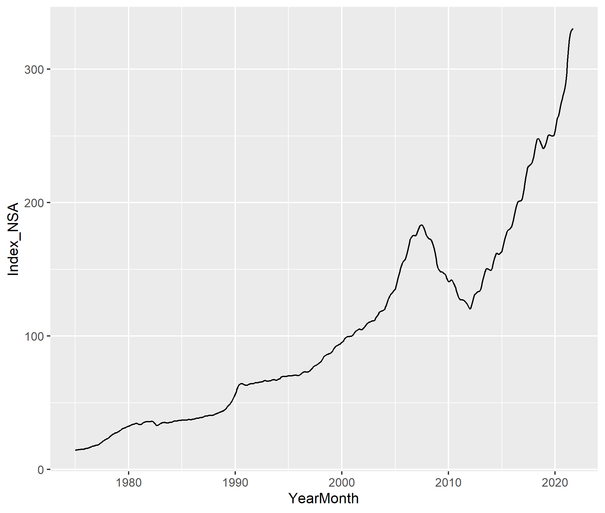

```{r setup, include=FALSE}
knitr::opts_chunk$set(echo = TRUE)
```

+Forecasting Housing Prices

Housing price growth has exploded in recent months and house prices in general have increased from 1975 onward. It has become vital to lenders, individuals, and government officials to monitor changes in house prices over time to appropriately plan for home ownership and changes in housing affordability at scale. We want to investigate how house prices have changed in the last decade and compare pre-pandemic to post-pandemic price changes.

+Research Question

How did the pandemic impact the behavior of the housing price index and what is the appropriate scheme (fixed, recursive, or rolling) that will help us best forecast the housing price index values after the pandemic?

+Data Description

We used the Freddie Mac House Price Index (FMPHI) available at http://www.freddiemac.com/research/indices/house-price-index.page.

Per the Freddie Mac website "the FMHPI provides a measure of typical price inflation for houses within the United States. Values are calculated monthly and released at the end of the following month. For example, the FMHPI for March is published in late April." The data includes seasonally and non-seasonally adjusted series which are available at three different geographical levels (metropolitan, state, and national)for each month going all the way back to January 1975.

For our forecasting analysis we split the data into an estimation set (1975 through 2019) and a prediction set (January 2020 onward) 

<br>

{width=500px height=500px}

We have created the following ACFs and PACFs based on the estimate and prediction sets of the data.

This ACF and PACF are based on the estimation set of data for the periods prior to Jan 1, 2020.

<br>

{width=500px height=500px}

<br>

{width=500px height=500px}

These ACF and PACF plots are based on the prediction set of data for the periods after Jan 1, 2020.

<br>

{width=500px height=500px}


<br>

{width=500px height=500px}

We then also created ACF and PACFs based on the logged differences of the estimation and prediction sets refered to above.

<br>

{width=500px height=500px}

<br>

{width=500px height=500px}


<br>

{width=500px height=500px}


<br>

{width=500px height=500px}

+Selecting a model

Because the ACF above has a geometrically decaying collation, the use of an AR model would be most appropriate. Because the PACF has a significant drop off at lag 3 we will use an AR(3) model. We might consider an AR(16) model but it will most likely be a case of over fitting. We then prepared AR3 and AR16 models using rolling, recursive, and fixed schemes to make the predictions.

+Choosing a Loss Function

We think that we have an asymmetrical loss function. Errors in predicting the house price index both in over predicting and under predicting do not have similar consequences. If we under forecast the house price index (ie it is higher that our estimate) then as a buyer we might under budget and continue to be unable to purchase a home. As a government interested in monitoring the housing market and making zoning decisions or creating policy for housing, a forecast below the actual would mean that we did not allocate enough to help individuals buy homes or that the policy decisions will not appropriately respond to the real prices in the house market. If we over predict the house price index, the consequences are less severe in that policy will continue to slow the house price growth we've seen since 2011.

+Assessing the forecasts

The AR(3) and AR(16) forecasts are very similar during the first half of 2020. Like all the models, the forecasts for the first half of 2020 lag the actual market behavior by about 30-45 days. We also note that the forecasts become more accurate during the second half of 2020. Based on the plots, after mid-2020, the AR(16) model becomes the better predictor of market behavior.

The traditional convention is to choose a simpler model (ie AR(3) in this scenario) because a simpler model is more likely to reflect the behaviors of a population when you build that model on observations of a sample group. A lower process number allows for randomness to exist in the model - which is realistic.

However, the AR(16) model runs counter to this precept. It appears that the AR(16) model is a better predictor of overall market behavior from mid 2020 and on vice being an over-fitted model is because lags 11 - 16 occurred during a time (2018) when the market index behaved in a fashion similar to the mid 2020- 2021 growth behavior. Because the lag 16 (11-16 actually) behavior better mirrors the 2020 -2021 behavior than the simpler lag 3 model (whose grows during the last 3 months of 2019 was significantly lower than previous lags). Including these additional lags refined the model by including the type of index behavior one could expect during a "hot" market time frame that is NOT captured in the simpler, short term, lag 3 model.
