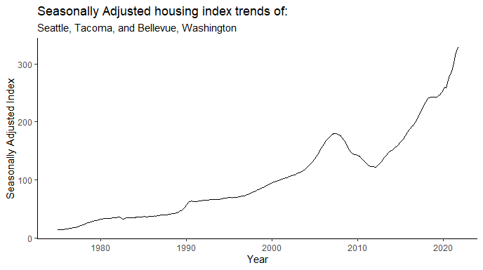
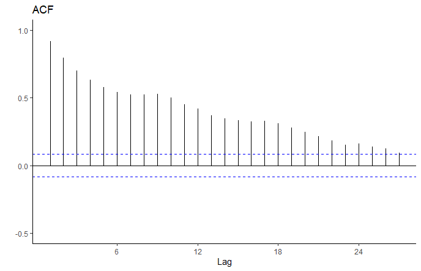
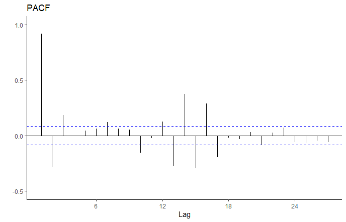
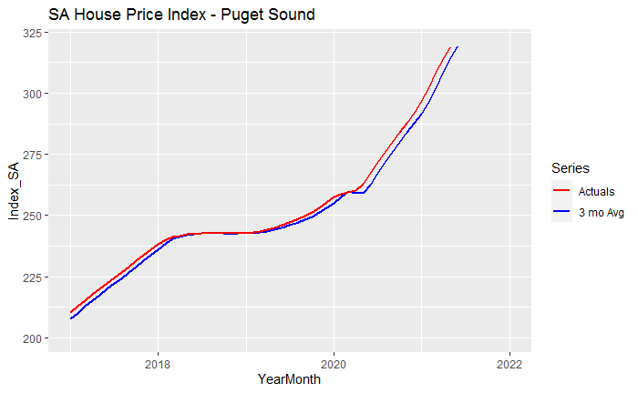
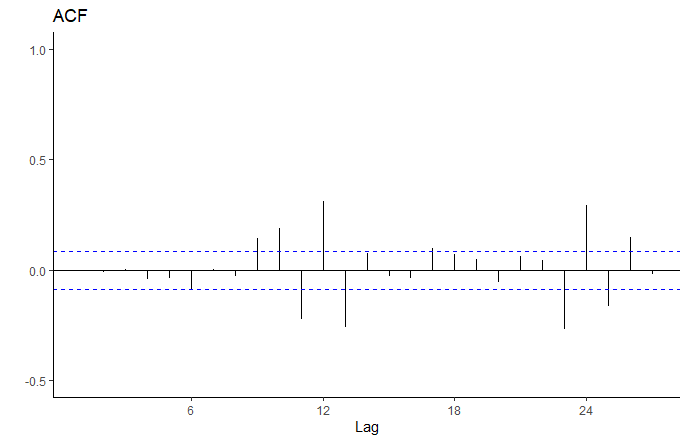
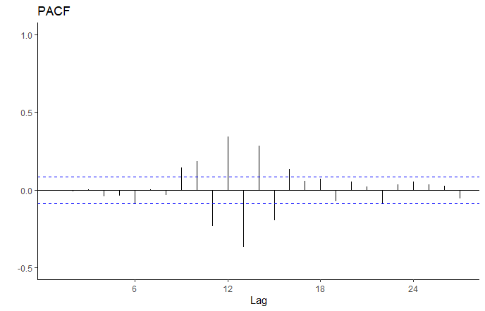
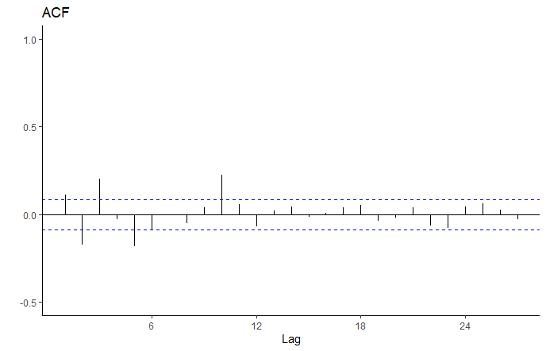
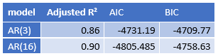
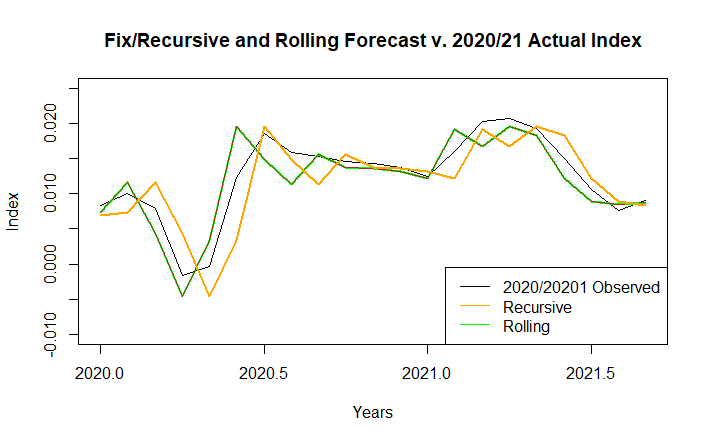
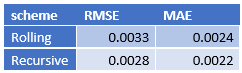

```{r setup, include=FALSE}
knitr::opts_chunk$set(echo = TRUE)
```

# Forecasting Housing Prices

In the Puget Sound region, housing price growth has exploded in recent months and house prices in general have increased from 1975 to present. It has become vital to lenders, individuals, and government officials to monitor changes in house prices over time to appropriately plan for home ownership and changes in housing affordability at scale. Our team investigated how house prices have changed in the last 45 years and compared price changes between pre-COVID-19 pandemic to post-COVID-19 pandemic time frames. 

# Research Question

How did the COVID-19 pandemic (“the pandemic”) impact the behavior of the housing price index and what is the appropriate forecasting scheme (Fixed, Recursive, or Rolling) that will help us best forecast the housing price index values after the pandemic?

# Data Description

We used the Freddie Mac House Price Index (FMPHI) available at http://www.freddiemac.com/research/indices/house-price-index.page.

Per the Freddie Mac website “the FMHPI provides a measure of typical price inflation for houses within the United States. Values are calculated monthly and released at the end of the following month. For example, the FMHPI for March is published in late April.” The data includes seasonally and non-seasonally adjusted series which are available at three different geographical levels (metropolitan, state, and national) for each month, dating back to January 1975.

For this project, we utilized our entire seasonally adjusted dataset, which ranged from January 1975 to September 2021. Figure 1 displays the seasonally adjusted housing index trends of our data as a timeseries. We see a steady increase in the trend line from 1975 up to 2008, which marks the bursting of the housing bubble. The trend decreases until about 2012, which is when the trend starts to explode up to the present day.


<br>

{width=688px height=385px}

**Figure 1**: Plot of our entire timeseries dataset

To make our data stationary, log difference was applied as seen in Figure 2. We witness a similar drop in index between 2008-2012, then see the trend quickly return to the mean. Taking the log difference revealed a spike in 1990 that did not seem significant in Figure 1. We also see dips in the early 80’s and late 10’s that did not appear to be present in the raw data plot.


<br>

{width=708px height=442px}

**Figure 2**: Plot of our data with log difference applied to achieve stationarity

In addition to plotting our data after taking the first log difference, an Augmented Dickey-Fuller Test (adf test) was performed so that we could verify that the null hypothesis would be rejected and that our timeseries was not stationary. Upon performing the adf test, it was confirmed that the timeseries with the log difference applied was in fact stationary. The results of the adf test is included below: 

The Augmented Dickey-Fuller Test:
    
  + Critical Value @ 5%: -2.87 w/o Trend | -2.41 w/ Trend
  + ADF: -3.2757

# Model Selection

Below are visuals of the Auto-Correlation Function distribution and the Partial-Auto-Correlation Function distribution for our stationary timeseries data. Because the ACF below has a geometrically decaying collation, the use of an AR model was determined to be most appropriate. 

<br>

{width=400px height=350px}

**Figure 3**: ACF distribution of stationary data

Because the PACF has a significant drop off at lag 3, it was determined to use an AR(3) model. Due to the clump of significant spikes between lags 11-16, an AR(16) model was considered. A model of this high of an order is assumed to lead to a case of over fitting. It was decided to investigate the performance of both models, AR(3) and AR(16), and compare the performance of the Fixed, Recursive, and Rolling schemes to make our predictions.

{width=400px height=350px}

**Figure 4**: PACF distribution of stationary data

To begin, a simple 3 month moving average was analyzed as seen in the figure below. It was found that the rolling averages inherently lag behind the actual observations. It is seen that there is consistent under-forecasting during the pandemic as seen with the significant divergence occurring after 2020. Lastly, it was determined that this model was prone to overstating impacts of sudden shocks in the market during this time frame. If a particularly bad month was followed by 2 good months, the average of the 3 months would typically over dampen the forecast, thus tamping out significant shocks that interested parties should be considering. The same was determined for the inverse, where an overly optimistic forecast would be displayed despite poor performance during the 3 month period.

<br>

{width=700px height=432px}

**Figure 5**: Simple 3 month moving average

The ACF and PACF were analyzed for both AR(3) and AR(16) models to determine which model would be most representative of the data. It was found that all values were statistically significant for both models. The ACF and PACF distributions for both models are included below. 

<br>

<br>

{width=400px height=350px}

{width=400px height=350px}

**Figure 6**: ACF and PACF distribution of AR(3) model

The intercept for the AR(3) model was found to be significant at 0.1. In this model, significant lags are seen in both the ACF and PACF from lags 11-16. 

<br>

{width=400px height=350px}

{width=400px height=350px}

**Figure 7**: ACF and PACF distribution of AR(16) model

The intercept for the AR(16) model was found to be significant at 0.5. The significant spikes are more tamped down in this model, although there is still some “stickiness” found in the earlier lags. This was attributed to random variation, since we see a white noise behavior from lag 11 onward.

<br>

The R^2^, AIC, and BIC values were calculated for both models and resulted in the following: 

<br>
{width=307px height=80px}

**Figure 8**: Table displaying R^2^, AIC, and BIC values

Based on The ACF and PACF distributions along with the R^2^, AIC, and BIC values, the AR(16) model was chosen to utilize in our forecasting schemes. 

# Forecasting Schemes

The Fixed, Recursive, and Rolling forecasting schemes were applied using the AR(16) model to make our forecasts. We split the data into an estimation set (1975 through 2019) and a prediction set (January 2020 onward). Surprisingly, the Fixed and Recursive schemes resulted in identical forecasts and values. When comparing the Rolling vs. Recursive schemes, the Recursive scheme had smaller errors when compared to the actual observed values of 2020 onward, which was used as our prediction sample. A comparison of the Fixed/Recursive scheme and Rolling scheme forecast vs. the Actual Index can be found in the figure below.

  
<br>

{width=708px height=442px}

**Figure 9**: Fixed/Recursive and Rolling forecast schemes plotted against observed values

The Root Mean Squared Error (RMSE) and Mean Absolute Error (MAE) were calculated and compared between the Rolling and Recursive schemes. The table below displays the values that were calculated:

<br>
{width=242px height=73px}

**Figure 10**: Comparison of Rolling and Recursive scheme RMSE and MAE values

Due to the lower error rates in both the RMSE and MAE, it was assessed that using the Recursive scheme using the AR(16) model would be our best model for forecasting into the future.

We then plotted how the confidence intervals of our AR(3) model forecasts fit over the actual pricing index from 2020 to present so that we could make comparisons between our estimation sample and our prediction sample. The confidence intervals were plotted by using the Recursive forecasting scheme. The distribution of spikes suggest a cyclical pattern during the pandemic related pricing, with decreased accuracy at the inflection points of the log/diff series. Given the calculated accuracy of our models as depicted through the R^2^, RMSE, and MAE values provided above, these forecasts are still representative, even though they struggled to forecast rapid market changes from April 2020 through July 2020. 

<br> 

 Recursive Scheme.png){width=700px height=432px}

**Figure 11**: Forecasts from ARIMA(3,0,0) with non-zero mean

# Loss Function

It was determined that we have a symmetrical loss function. Errors in predicting the house price index both in over predicting and under predicting do have similar consequences as the main parties impacted are either buyers or sellers and the trade-off in an estimation error in either direction proportionately impact both parties the same. We determined that there is a not a clear loss in either scenario as a gain for one party is a loss for another and vice versa.

# Conclusions and Future Research

The AR(3) and AR(16) forecasts are very similar during the first half of 2020. Like all the models, the forecasts for the first half of 2020 lag the actual market behavior by about 30-45 days. We also note that the forecasts become more accurate during the second half of 2020. Based on the plots, after mid-2020, the AR(16) model becomes the better predictor of market behavior. Both models are statistically significant models, but the AR(16) model better captures the volatility of the housing prices in Puget Sound during the pandemic. It was found that the Recursive scheme is more representative than the Fixed and Rolling schemes.

The traditional convention is to choose a simpler model (ie AR(3) in this scenario) because a simpler model is more likely to reflect the behaviors of a population when you build that model on observations of a sample group. A lower process number allows for randomness to exist in the model, which is realistic. However, the AR(16) model runs counter to this precept. It appears that the AR(16) model is a better predictor of overall market behavior from mid-2020 because lags 11-16 occurred during a time (2018) when the market index behaved in a fashion similar to the mid-2020 to 2021 growth behavior. The behavior seen in lags 11-16 better mirrors the 2020-2021 behavior than the simpler AR(3) model, whose growth during the last 3 months of 2019 was significantly lower than previous lags. Including these additional lags refined the model by including the type of index behavior one could expect during a “hot” market time frame that is not captured in the simpler, short term, AR(3) model.

There are many opportunities for future research on this topic. An investigation on deterministic trends in the data could be performed to assess the level randomness of the Freddie Mac data set during the pandemic. Also, a reassessment of the models described in this research could be performed in the near future to validate our findings and to also assess the effects of ongoing changes regarding the pandemic, such as the mutation of the delta and omicron variants and the constant shifting of guidance provided by the CDC and WHO.
