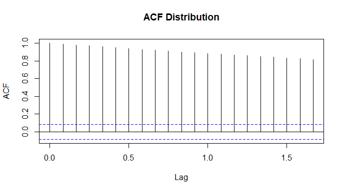
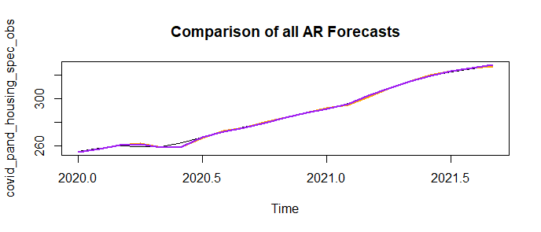

```{r setup, include=FALSE}
knitr::opts_chunk$set(echo = TRUE)
```

# Forecasting Housing Prices

In the Puget Sound region, housing price growth has exploded in recent months and house prices in general have increased from 1975 onward. It has become vital to lenders, individuals, and government officials to monitor changes in house prices over time to appropriately plan for home ownership and changes in housing affordability at scale. Our team investigated how house prices have changed in the last decade and compare price changes between pre-COVID-19 pandemic to post-COVID-19 pandemic time frames. 

# Research Question

How did the COVID-19 pandemic ("the pandemic") impact the behavior of the housing price index and what is the appropriate scheme (fixed, recursive, or rolling) that will help us best forecast the housing price index values after the pandemic?

# Data Description

We used the Freddie Mac House Price Index (FMPHI) available at http://www.freddiemac.com/research/indices/house-price-index.page.

Per the Freddie Mac website "the FMHPI provides a measure of typical price inflation for houses within the United States. Values are calculated monthly and released at the end of the following month. For example, the FMHPI for March is published in late April." The data includes seasonally and non-seasonally adjusted series which are available at three different geographical levels (metropolitan, state, and national) for each month, dating back to January 1975.

For this project, we utilized our entire dataset, which ranged from January 1975 to September 2021. Figure 1 displays the seasonally adjusted housing index trends of our data as a timeseries. We see a steady increase in the trend line from 1975 up to 2008, which marks the bursting of the housing bubble. The trend decreases until about 2012, when the trend starts to explode up to the present. To make our data stationary, we applied the log difference as seen in Figure 2. We witness a similar drop in index between 2008-2012, then see the trend return to the mean. Taking the log difference reveals a spike in 1990 that did not seem very significant in Figure 1. We also see dips in the early 80's and late 10's that do not appear to be present in the raw data plot. 

For our forecasting analysis we split the data into an estimation set (1975 through 2019) and a prediction set (January 2020 onward) 

<br>

{width=600px height=450px}

Figure 1: Plot of our entire timeseries dataset

<br>

{width=600px height=450px}

Figure 2: Plot of our data with log difference applied to achieve stationarity

Below are visuals of the Auto-Correlation Function distribution and the Partial-Auto-Correlation Function distribution for our entire dataset. 

<br>

{width=600px height=450px}

Figure 3: ACF distribution of our entire dataset

<br>

{width=600px height=450px}

Figure 4: PACF distribution of our entire dataset

# Selecting a model

Because the ACF above has a geometrically decaying collation, the use of an AR model would be most appropriate. Because the PACF has a significant drop off at lag 3 we will use an AR(3) model. We might consider an AR(16) model but it will most likely be a case of over fitting. We then prepared AR3 and AR16 models using rolling, recursive, and fixed schemes to make the predictions.

# Forecasting schemas

+ Discuss the results from the Fixed scheme, Recursive scheme, and Rolling scheme

+ Include table with AIC and BIC rates 

+ Include results from auto-ARIMA calculation


# Choosing a Loss Function

We think that we have a symmetrical loss function. Errors in predicting the house price index both in over predicting and under predicting do have similar consequences as the main parties impacted are either buyers or sellers and the trade-off in an estimation error in either direction proportionately impact both parties the same. We determined that there is a not a clear loss in either scenario as a gain for one party is a loss for another and vice versa.

# Assessing the forecasts

The AR(3) and AR(16) forecasts are very similar during the first half of 2020. Like all the models, the forecasts for the first half of 2020 lag the actual market behavior by about 30-45 days. We also note that the forecasts become more accurate during the second half of 2020. Based on the plots, after mid-2020, the AR(16) model becomes the better predictor of market behavior.

The traditional convention is to choose a simpler model (ie AR(3) in this scenario) because a simpler model is more likely to reflect the behaviors of a population when you build that model on observations of a sample group. A lower process number allows for randomness to exist in the model - which is realistic.

<br>

{width=600px height=450px}

Figure #: Plot showing all AR Forecasts plotted together

# Results Discussion

However, the AR(16) model runs counter to this precept. It appears that the AR(16) model is a better predictor of overall market behavior from mid 2020 and on vice being an over-fitted model is because lags 11 - 16 occurred during a time (2018) when the market index behaved in a fashion similar to the mid 2020- 2021 growth behavior. Because the lag 16 (11-16 actually) behavior better mirrors the 2020 -2021 behavior than the simpler lag 3 model (whose grows during the last 3 months of 2019 was significantly lower than previous lags). Including these additional lags refined the model by including the type of index behavior one could expect during a "hot" market time frame that is NOT captured in the simpler, short term, lag 3 model.

For the AR(3) model we completed a recursive, fixed, and rolling scheme. The fixed and rolling schemes are consistent with each other and the recursive model provided a forecast width of 0.1 in the index. We also used the fixed and rolling schemes in the AR(16) module and noted that those schemes also provide similar forecasts.
