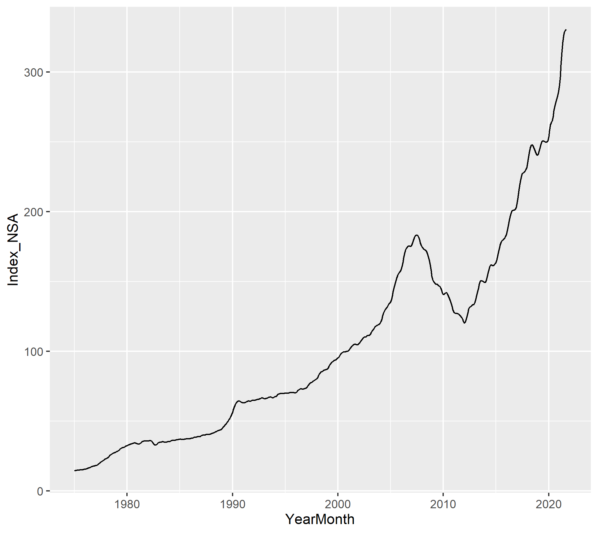
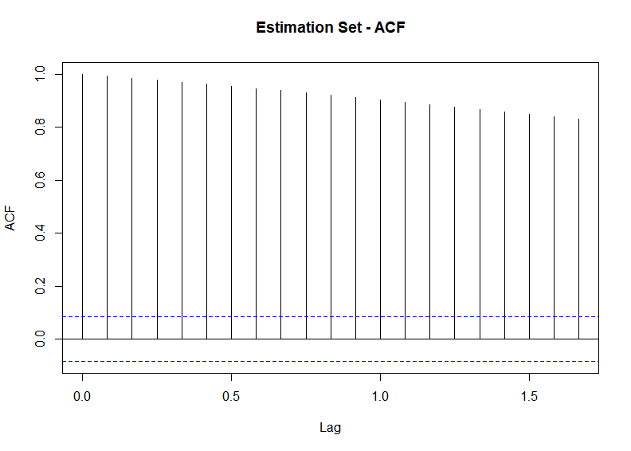
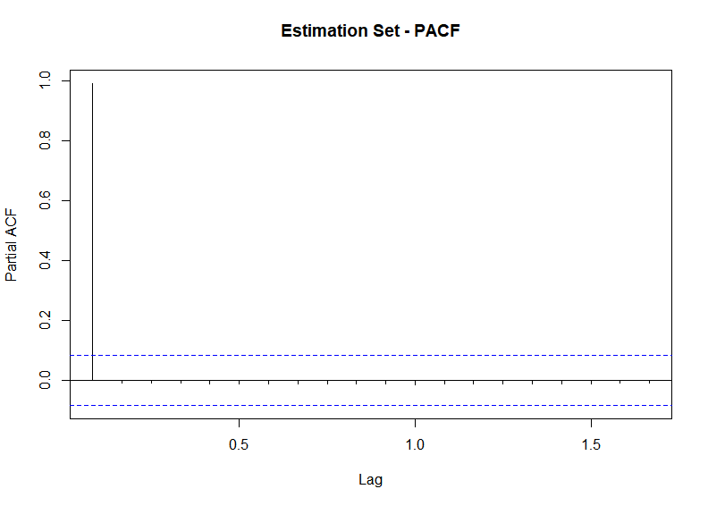
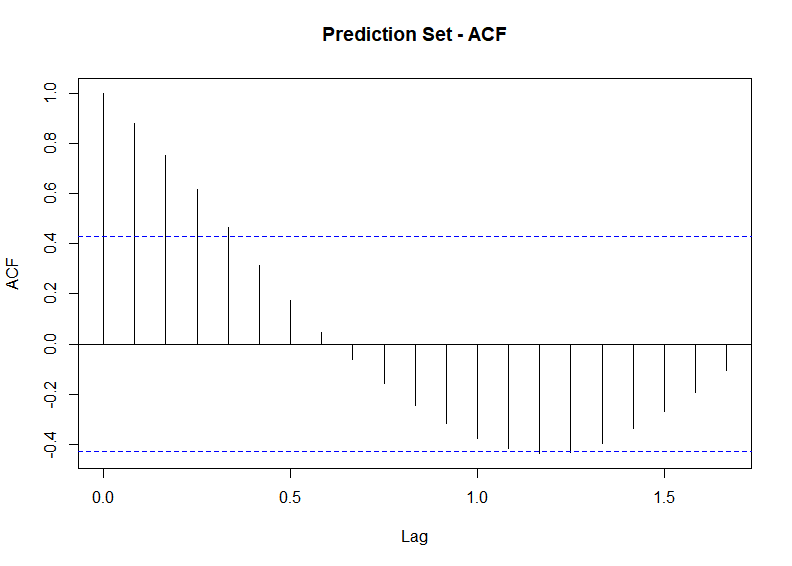
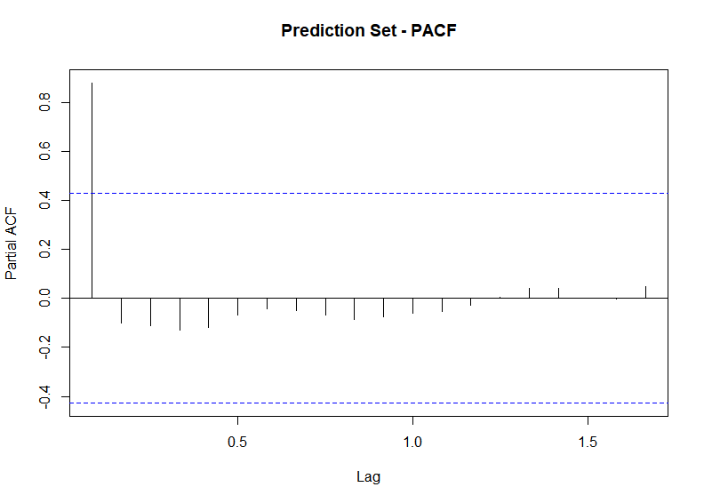
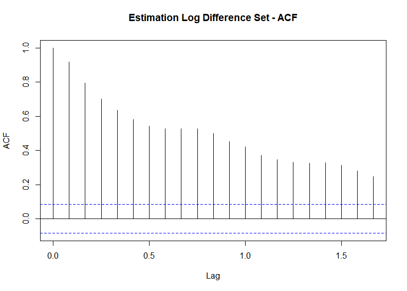
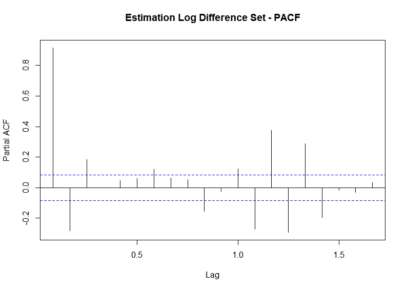
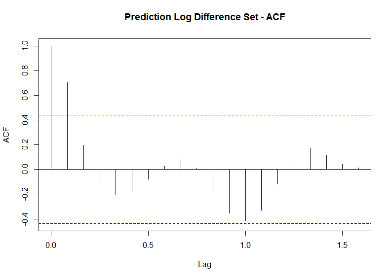
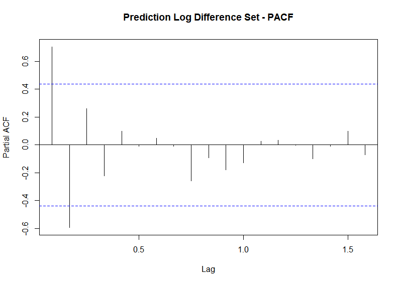

```{r setup, include=FALSE}
knitr::opts_chunk$set(echo = TRUE)
```

+Forecasting Housing Prices

Housing price growth has exploded in recent months and house prices in general have increased from 1975 onward. It has become vital to lenders, individuals, and government officials to monitor changes in house prices over time to appropriately plan for home ownership and changes in housing affordability at scale. We want to investigate how house prices have changed in the last decade and compare pre-pandemic to post-pandemic price changes.

+Research Question

How did the pandemic impact the behavior of the housing price index and what is the appropriate scheme (fixed, recursive, or rolling) that will help us best forecast the housing price index values after the pandemic?

+Data Description

We used the Freddie Mac House Price Index (FMPHI) available at http://www.freddiemac.com/research/indices/house-price-index.page.

Per the Freddie Mac website "the FMHPI provides a measure of typical price inflation for houses within the United States. Values are calculated monthly and released at the end of the following month. For example, the FMHPI for March is published in late April." The data includes seasonally and non-seasonally adjusted series which are available at three different geographical levels (metropolitan, state, and national)for each month going all the way back to January 1975.

For our forecasting analysis we split the data into an estimation set (1975 through 2019) and a prediction set (January 2020 onward) 

<br>

{width=500px height=500px}

We have created the following ACFs and PACFs based on the estimate and prediction sets of the data.

<br>

{width=500px height=500px}

<br>

{width=500px height=500px}

<br>

{width=500px height=500px}


<br>

{width=500px height=500px}

We then also created ACF and PACFs based on the logged differences.

<br>

{width=500px height=500px}

<br>

{width=500px height=500px}


<br>

{width=500px height=500px}


<br>

{width=500px height=500px}


